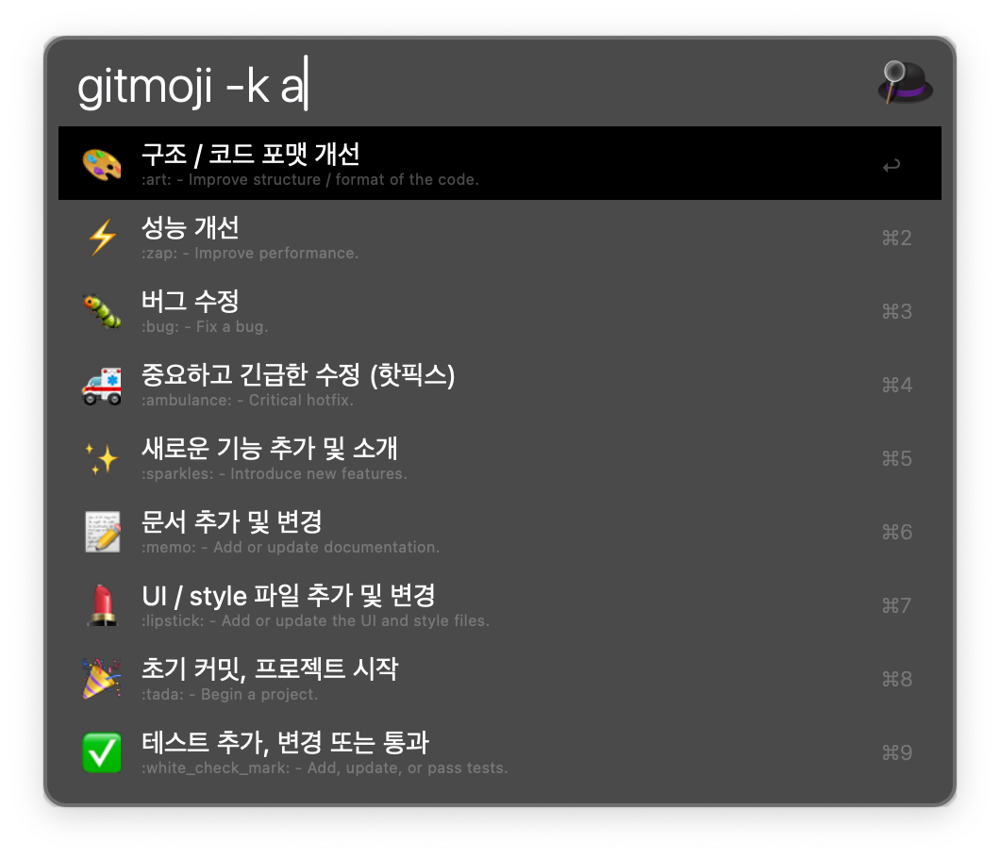

<div align="center">

  

  [](https://codecov.io/gh/eugenejeonme/alfred-gitmoji)
  [](https://github.com/eugenejeonme/alfred-gitmoji/issues)
  <!-- [](https://github.com/eugenejeonme/alfred-gitmoji/pulls) -->
  [](https://scorecard.dev/viewer/?uri=github.com/eugenejeonme/alfred-gitmoji)

  [버그제보하기](https://github.com/eugenejeonme/alfred-gitmoji/issues/new?assignees=&labels=bug&projects=&template=bug_report.yml)
  · [기능 추가 요청하기](https://github.com/eugenejeonme/alfred-gitmoji/issues/new?assignees=&labels=enhancement&projects=&template=feature_request.yml)

  [English](https://github.com/eugenejeonme/alfred-gitmoji/blob/main/README.md)
  · [한국어](https://github.com/eugenejeonme/alfred-gitmoji/blob/main/README-ko.md)

</div>

## 📖 Alfred Gitmoji Workflow

Alfred Workflow 에서 [Gitmoji](https://gitmoji.dev/related-tools) 를 검색/복사할 수 있도록 만든 것입니다.



## 💾 설치방법

1. [Alfred](https://www.alfredapp.com/)가 설치되어 있어야 합니다. (Powerpack 라이센스 필요)

2. 다음 중 한 가지 방법으로 워크플로우를 설치할 수 있습니다:
   - [최신 릴리즈](https://github.com/[사용자명]/[저장소명]/releases/latest)에서 `.alfredworkflow` 파일을 다운로드하여 실행
   - ~~`brew install alfred-gitmoji-workflow` 명령어로 설치 (Homebrew 필요)~~ **Note:** ⚠️ Not yet available

3. Alfred에서 `gitmoji`를 입력하여 정상적으로 작동하는지 확인하세요.

## 🎮 사용법

Alfred에서 `gitmoji` 키워드를 입력하면 gitmoji 목록이 표시됩니다.
원하는 이모지를 선택한 후:

- <kbd>return</kbd> (↵): 선택한 이모지의 심볼(예: "🐛")을 클립보드에 복사합니다.
- <kbd>option+return</kbd> (⌥↵): 선택한 gitmoji의 코드(예: `:bug:`)를 현재 활성화된 애플리케이션에 직접 복사합니다.
- <kbd>shift+return</kbd> (⇧↵): 선택한 이모지의 16진수 HTML 엔티티(예: `&#x1f41b;`)를 클립보드에 복사합니다.

검색 시 이모지 이름이나 설명으로도 검색이 가능합니다. (예: "bug", "fix" 등)

한글로 검색 결과를 보고 싶다면 `gitmoji -k` 또는 `gitmoji -ko`를 입력하세요.

## ⚡️ Benchmark

작성된 zsh, py 두 파일의 주요 작업들을 비교해보면:

1. JSON 파싱/처리
- Python: `json` 모듈 사용 (네이티브 구현)
- Zsh: `jq` 명령어 사용 (외부 프로세스 호출)

2. 문자열 처리
- Python: 내장 문자열 메소드 사용
- Zsh: 기본 문자열 처리 + perl 호출 (외부 프로세스)

3. 파일 시스템 작업
- Python: `os`, `pathlib` 모듈 사용
- Zsh: 네이티브 명령어 사용

간단한 벤치마크 스크립트를 만들어볼 수 있습니다:

```zsh
#!/bin/zsh

# benchmark.zsh
time_zsh() {
    local start=$(($(gdate +%s%N)/1000000))
    ./workflowscript.zsh "배포"
    local end=$(($(gdate +%s%N)/1000000))
    echo "Zsh execution time: $((end-start)) ms"
}

time_python() {
    local start=$(($(gdate +%s%N)/1000000))
    ./workflowscript.py "배포"
    local end=$(($(gdate +%s%N)/1000000))
    echo "Python execution time: $((end-start)) ms"
}

echo "Running benchmark..."
echo "Zsh version:"
time_zsh
echo "\nPython version:"
time_python
```

예상되는 결과:
1. 초기 실행 시:
   - Python이 더 느릴 수 있음 (인터프리터 시작 시간)
   - Zsh가 더 빠를 수 있음 (이미 실행 중인 셸 사용)

2. 반복 실행 시:
   - Python이 더 빠를 가능성이 높음
   - 이유:
     - 네이티브 JSON 처리
     - 외부 프로세스 호출 없음
     - 효율적인 문자열 처리

3. 메모리 사용:
   - Python이 더 많은 메모리 사용
   - Zsh는 더 가벼운 메모리 사용

작업의 특성상 (JSON 파싱, 문자열 처리가 주요 작업) Python이 조금 더 빠를 것으로 예상됩니다.
