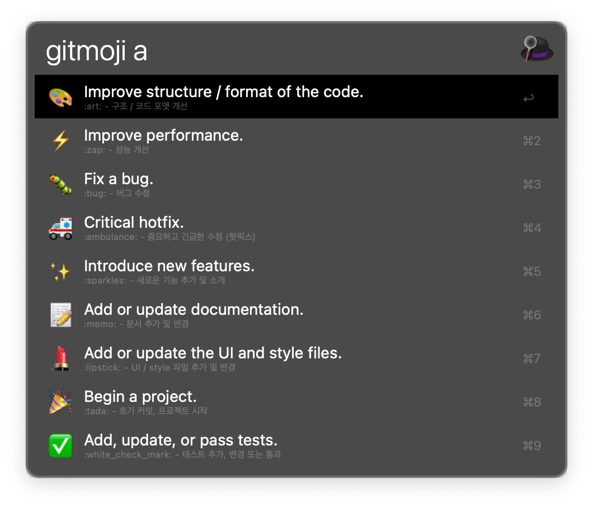

<div align="center">


[English](https://github.com/eugenejeonme/alfred-gitmoji/blob/main/README.md)
· [한국어](https://github.com/eugenejeonme/alfred-gitmoji/blob/main/README-ko.md)

[Report Bug](https://github.com/eugenejeonme/alfred-gitmoji/issues/new?assignees=&labels=bug&projects=&template=bug_report.yml)
· [Request Feature](https://github.com/eugenejeonme/alfred-gitmoji/issues/new?assignees=&labels=enhancement&projects=&template=feature_request.yml)

</div>

## 📖 Alfred Gitmoji Workflow



A workflow for searching and copying Gitmoji in Alfred.

## 💾 Installation

1. [Alfred](https://www.alfredapp.com/) must be installed (Powerpack license required)

2. You can install the workflow in one of the following ways:
   - Download the `.alfredworkflow` file from the [latest release](https://github.com/[username]/[repository]/releases/latest) and open it
   - ~~Install with Homebrew: `brew install alfred-gitmoji-workflow`~~ > **Note:** ⚠️ Not yet available

3. Type `gitmoji` in Alfred to verify that it's working properly.

## 🎮 Usage

Type `gitmoji` in Alfred to display the list of gitmojis. After selecting the desired emoji:

- <kbd>return</kbd> (↵): Copy the emoji symbol (e.g. "🐛") to your clipboard.
- <kbd>option+return</kbd> (⌥↵): Copy the gitmoji code (e.g. `:bug:`) directly to your front-most application.
- <kbd>shift+return</kbd> (⇧↵): Copy the hexadecimal HTML Entity (e.g. `&#x1f41b;`) to your clipboard.

You can search by emoji name or description (e.g. "bug", "fix", etc.).

To see search results in Korean, type `gitmoji -k` or `gitmoji -ko`.

## ⚡️ Benchmark

Comparing the main operations of the two files (zsh and py):

1. JSON Parsing/Processing
- Python: Uses `json` module (native implementation)
- Zsh: Uses `jq` command (external process call)

2. String Processing
- Python: Uses built-in string methods
- Zsh: Basic string processing + perl call (external process)

3. File System Operations
- Python: Uses `os`, `pathlib` modules
- Zsh: Uses native commands

Here's a simple benchmark script:

```zsh
#!/bin/zsh

# benchmark.zsh
time_zsh() {
    local start=$(($(gdate +%s%N)/1000000))
    ./workflowscript.zsh "deploy"
    local end=$(($(gdate +%s%N)/1000000))
    echo "Zsh execution time: $((end-start)) ms"
}

time_python() {
    local start=$(($(gdate +%s%N)/1000000))
    ./workflowscript.py "deploy"
    local end=$(($(gdate +%s%N)/1000000))
    echo "Python execution time: $((end-start)) ms"
}

echo "Running benchmark..."
echo "Zsh version:"
time_zsh
echo "\nPython version:"
time_python
```

Expected results:
1. Initial Execution:
- Python might be slower (interpreter startup time)
- Zsh might be faster (using already running shell)

2. Repeated Execution:
- Python is likely to be faster
- Reasons:
  - Native JSON processing
  - No external process calls
  - Efficient string processing

3. Memory Usage:
- Python uses more memory
- Zsh uses lighter memory

Given the nature of the work (JSON parsing, string processing being the main tasks), Python is expected to be slightly faster.
